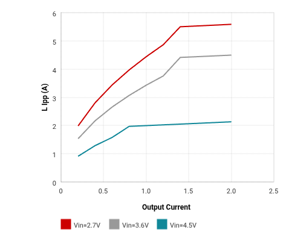
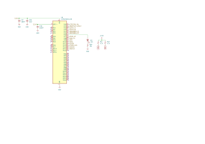
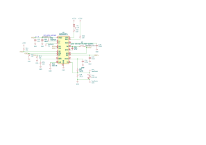

# July 5: first commit

started the pmm project. backstory: my mp3 player needs a power section and i realized i was about to design the same battery circuit for the third time. every battery project wants the same thing - charge a cell, know what's left in it, make clean rails from a sagging voltage. so this time i'm building that once, properly, as a standalone module everything else can reuse.

architecture settled on day one: bq25895 for charging (2a buck charger, does usb negotiation properly), bq27441-g1 as an actual fuel gauge instead of the usual voltage-to-percent hand-waving (li-ion voltage curves are flat enough that guessing from voltage is close to lying), tps61089 boost back to 5v, tps22917 load switch so output power is actually controllable, stm32c031 supervising it all.

before committing to the tps61089 circuit i ran it through ti's webbench and saved the waveforms and bom. quick check to see if the part fits my operating points before drawing anything.

**Total time spent: 4 hours**

# July 7: 3.3V regulator

worked on the 3.3v regulator section. this rail only feeds the mcu and the gauge, so it's a job for a boring reliable ldo - picked the tlv75733 and started its subcircuit. input cap, output cap, done right.

small board lesson i keep relearning: even trivial subcircuits deserve real attention, because the regulator is the first thing to come up at plug-in and everything downstream assumes it behaved.

**Total time spent: 2 hours**

# July 9: sub-sheets and regulator fixes

broke the schematic into hierarchical sub-sheets, one per major ic: bq25895 charger, bq27441 fuel gauge, tps61089 boost, tps22917 load switch, tlv75733 ldo, stm32 mcu. each of these chips has a datasheet reference circuit worth copying *thinking about* and they'd fight for space on one flat sheet. separate sheets also mean each chip's section can be read against its own datasheet page by page.

fixed the 3.3v regulator circuit from two days ago and cleaned up inter-sheet connections.

**Total time spent: 3 hours**

# July 13: finished schematics

all sub-sheets done and connected. the stm32 sheet took the longest because pin mapping on a small package is a puzzle - every function wants a specific pin and the assignments have to not conflict with each other.

also drew a custom pmm symbol and footprint for the parts library, treating the whole module as one component when it appears in other projects' schematics. that's the point of making this a module.

**Total time spent: 5 hours**

# July 14: PCB routing

started layout and got most of the board routed across several passes. priority order matters here: power path first (charger -> battery -> boost), because those traces carry real current and set the terms everything else routes around. signals fill in afterward.

added the tlv757p.pdf datasheet to the folder (that's the ldo's - the tps61089 pdf was already in there).

**Total time spent: 6 hours**

# July 16: finished PCB

4-layer layout complete. four layers earns its keep on a board like this: ground plane under everything for return paths, and the bq25895's switching node wanted careful short-loop treatment - that converter swings amps around at 800khz-ish and sloppy loops show up as noise everywhere else.

routed the remaining bq25895 traces and closed out all nets.

**Total time spent: 5 hours**

# July 17: silkscreen and cleanup

silkscreen art: empire logo and linux penguin. a board without art is just a circuit.

reorganized the parts library (logo/ became logo.pretty/) and moved old schematic revisions into a backup folder so the main project directory only contains things that are true.

**Total time spent: 3 hours**

# July 21: firmware

platformio firmware time. mcu is the stm32c031c4t6 running off its internal 48mhz hsi - no crystal, because a power supervisor doesn't need timing precision, and one less component to fail bring-up.

pin plan: i2c1 (pa9/pa10) talks to both ti chips, bq25895 at 0x6b and bq27441 at 0x55. usart2 (pa2/pa3) at 115200 for debug prints. adc1 (pa8) watches vbus so firmware knows if usb is present. gpio for the control surface: pa0 load switch, pa4 charger ce, pa6 led, pa11 shdn, pa12 force_on.

wrote drivers for both ti parts from the register maps, plus system init, a state machine, led blinker, periodic uart status. platformio doesn't ship stm32cubec0 yet so installed it straight from st's github. then fixed the predictable first-build casualties: wrong i2c alternate function mapping, no apb prescaler on the c0 series, adc sample time, extern declarations missing.

build lands at ram 4.5% (552 bytes) and flash 62.3% (20 kb). plenty of headroom for whatever rev 2 learns it needs.

**Total time spent: 4 hours**
