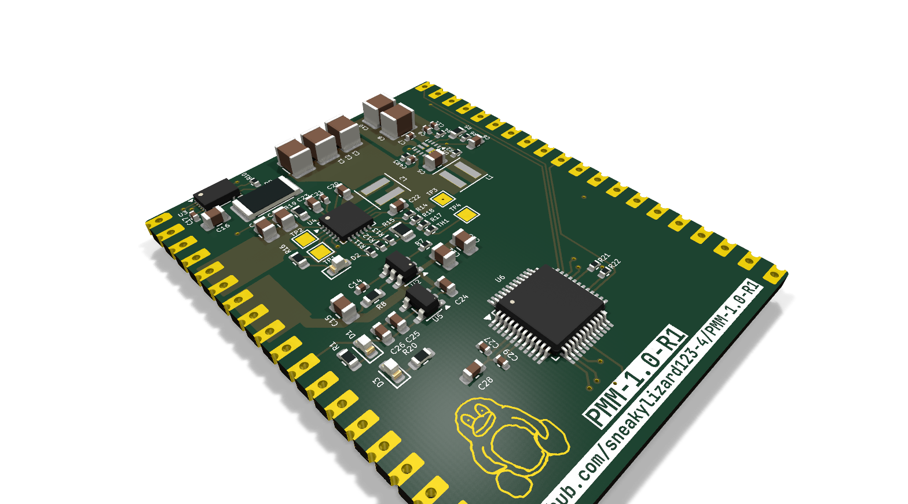
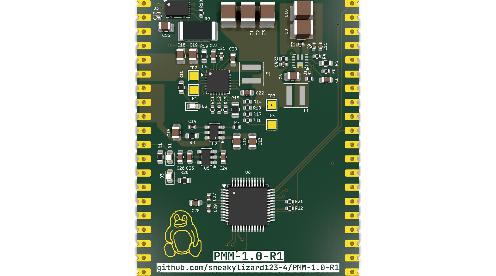
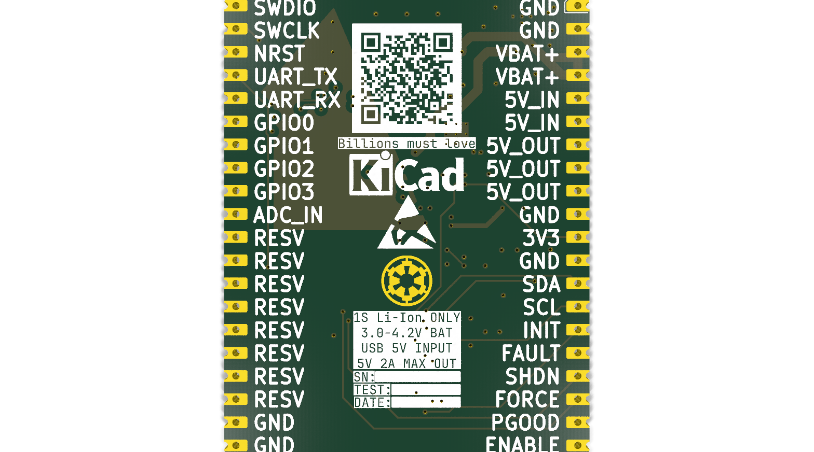
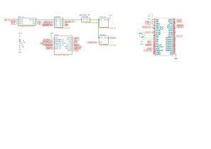

# PMM-1.0-R1 (Power Management Module)

USB-C battery management board. Charges a Li-ion/LiPo cell, reports state of charge with a real fuel gauge (BQ27441), and boosts to a switched 5V output. 50x30mm, four-layer PCB.

## NOTE TO REVIEWER!!!
iv rewritten this thing multiple times

## Why I built this

I keep building things that run off batteries, and I got tired of re-laying-out a charger and a boost converter from scratch every time. Every battery project needs the same core: charge the cell, know what's left, and get a usable rail out of a cell that sags from 4.2V down to about 3V. I was doing that discretely each time, with a different charger layout, a different output stage, and no consistency between projects.

So I made a single module that covers all of it. Charging, boost conversion, fuel gauging, and output sequencing, all in one place with a simple control interface (force-on, shutdown, status over UART/I2C). The first user is my MP3 player (hopefully), but anything else I build with a battery can plug into this same board.

```
USB VBUS (5V)
    │
    ├──► BQ25895 (Charger IC)
    │         │
    │         ▼
    │    Battery (Li-ion)
    │         │
    │         ▼
    │    TPS61089 (Boost) ───► 5V Output
    │         │
    │         ▼
    │    TLV75733 (LDO) ───► 3.3V MCU
    │
    └──► BQ27441 (Fuel Gauge)
```

| Block | Part | Role |
|-------|------|------|
| Charger | BQ25895 | 2A buck charger, USB input, battery management |
| Fuel gauge | BQ27441-G1 | State-of-charge reporting over I2C |
| Boost | TPS61089 | Battery up to regulated 5V output |
| Load switch | TPS22917 | Protected, controllable output |
| MCU supply | TLV75733 | 3.3V rail |
| MCU | STM32C031C4T6 | Cortex-M0+ supervision and control |

The STM32 supervises everything. It enables or kills the output through the load switch, watches VBUS with an ADC, reads charge status and fuel gauge data over I2C, and exposes the whole thing on a debug UART.

## Specifications

| Parameter | Value |
|-----------|-------|
| Input | 5V via USB-C |
| Output | 5V boosted, switched by load switch |
| MCU rail | 3.3V |
| Charge current | Up to 2A |
| Board size | ~50 x 30mm |
| Layers | 4 |

## Firmware

PlatformIO project targeting the STM32C031C4T6, running on its internal 48MHz HSI (no crystal needed for this job).

- I2C1 (PA9/PA10): BQ25895 charger at 0x6B, BQ27441 fuel gauge at 0x55
- USART2 (PA2/PA3): 115200 debug/status output
- ADC1 (PA8): VBUS monitoring
- GPIO: load switch (PA0), charger CE (PA4), LED (PA6), SHDN (PA11), FORCE_ON (PA12)

Drivers written from scratch for both TI parts, plus init, a state machine, LED blinker, and periodic status prints over UART. Build fits in RAM 4.5% / Flash 62.3%.

## Bill of Materials

Main ICs:

| References | Qty | Part | Package |
|------------|-----|------|---------|
| U4 | 1 | BQ25895RTW | QFN-24 |
| U3 | 1 | BQ27441-G1 | DSON-12 |
| U1 | 1 | TPS61089 | VQFN-11 |
| U2 | 1 | TPS22917DBV | SOT-23-6 |
| U5 | 1 | TLV75733PDBV | SOT-23-5 |
| U6 | 1 | STM32C031C4T6 | LQFP-48 |

Passives and connectors are listed in [BOM.csv](BOM.csv) with footprints and quantities. Supplier links and per-part pricing are still being filled in, cost table coming before ordering.

## Images

### 3D Model


### PCB Layout


### PCB Bottom (Silkscreen)


### Schematic


## Known Issues

- Board has not been fabricated or tested, this is rev 1 awaiting fab.
- Need to make sure breadboard can handle it.

## Credits

- TI reference designs for BQ25895 and BQ27441 application circuits.
- TPS61089 design simulated in TI WEBENCH to check operating points before committing to it.
- KiCad and its libraries.
